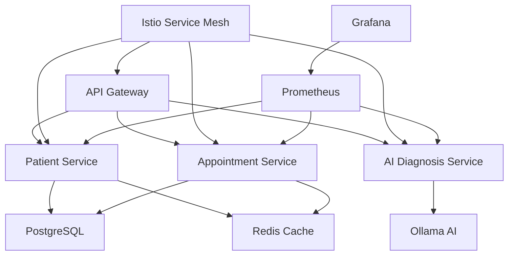
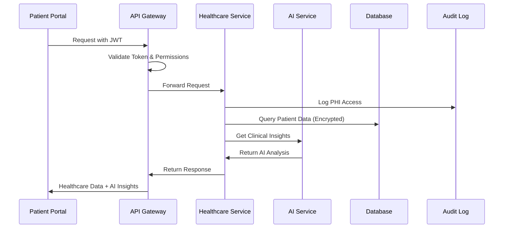
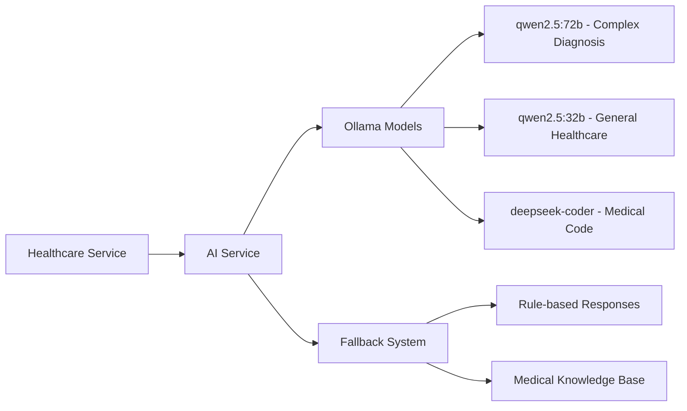

# 🏥 MedinovAI Full Module Development Package

## 📋 Package Overview

This comprehensive package provides everything needed to develop new modules using the MedinovAI architecture. It includes specifications, prompts, templates, and examples that ensure consistency, security, and healthcare compliance across all services.

**Package Version**: 2.0.0  
**Created**: September 26, 2025  
**Architecture**: MedinovAI Microservices on Kubernetes with AI Integration

---

## 📦 Package Contents

### 1. 📖 Comprehensive Specifications
**File**: `MEDINOVAI_MODULE_DEVELOPMENT_SPECS.md`

Complete architectural specifications covering:
- **Service Architecture Patterns**: FastAPI microservices with healthcare focus
- **AI Integration Standards**: Ollama-based AI services with medical specialization
- **Security Requirements**: HIPAA compliance, PHI protection, audit logging
- **Infrastructure Patterns**: Kubernetes deployment with Istio service mesh
- **Development Standards**: Code quality, testing, monitoring requirements
- **Healthcare Compliance**: Medical regulations, safety requirements

### 2. 🎯 Cursor Development Prompts  
**File**: `CURSOR_DEVELOPMENT_PROMPTS.md`

AI-assisted development prompts for:
- **Master Development Prompt**: Complete healthcare module development
- **Specialized Service Prompts**: API, AI/ML, Database, Frontend services
- **Development Workflow Prompts**: Setup, testing, deployment automation
- **Use Case Prompts**: Patient management, AI diagnosis, analytics
- **Maintenance Prompts**: Performance optimization, security hardening

### 3. 🛠️ Production-Ready Templates
**Directory**: `templates/`

Complete service templates including:
- **FastAPI Service Template** (`fastapi-service-template.py`)
  - Healthcare-compliant web service with AI integration
  - Authentication, authorization, and audit logging
  - Prometheus metrics and structured logging
  - Error handling and fallback mechanisms

- **Kubernetes Deployment** (`k8s-deployment-template.yaml`)
  - Security-hardened pod configurations
  - Istio service mesh integration
  - Auto-scaling and high availability
  - Network policies and RBAC

- **Docker Configuration** (`Dockerfile-template`)
  - Multi-stage build for production
  - Security hardening and non-root user
  - Health checks and monitoring
  - HIPAA-compliant container setup

- **Dependencies** (`requirements-template.txt`)
  - Healthcare-specific Python packages
  - AI/ML libraries for medical applications
  - Security and compliance tools
  - Production-ready versions

- **Test Suite** (`pytest-template.py`)
  - Comprehensive test coverage
  - Security and compliance testing
  - AI integration testing
  - Performance and load testing

### 4. 📚 Usage Guide
**File**: `TEMPLATE_USAGE_GUIDE.md`

Step-by-step instructions for:
- **Quick Start**: Creating new services in minutes
- **Template Customization**: Adapting templates for specific needs
- **Development Workflow**: Local development to production deployment
- **Service Examples**: Patient management, AI diagnosis, integration services
- **Troubleshooting**: Common issues and solutions

---

## 🚀 Quick Start Guide

### 1. Choose Your Service Type

| Service Type | Port Range | Use Cases | Templates Needed |
|--------------|------------|-----------|------------------|
| 🌐 **API Services** | 8000-8099 | Patient management, appointments, clinical data | FastAPI + K8s + Tests |
| 🤖 **AI/ML Services** | 8400-8499 | Diagnosis assistance, drug checking, clinical NLP | FastAPI + AI Integration |
| 🎨 **Frontend Services** | 8100-8199 | Patient portals, provider dashboards | React + K8s + Docker |
| 🗄️ **Database Services** | 8200-8299 | Data persistence, analytics, reporting | PostgreSQL + K8s |
| 🔗 **Integration Services** | 8500-8599 | HL7, FHIR, EHR integration | FastAPI + Integration |

### 2. Use the Master Cursor Prompt

Copy this prompt into Cursor to generate a complete service:

```markdown
# MedinovAI Module Development Assistant

You are developing a new [SERVICE_TYPE] for the MedinovAI healthcare ecosystem.

## SERVICE REQUIREMENTS
- **Name**: [SERVICE_NAME]
- **Port**: [PORT_NUMBER] 
- **Purpose**: [HEALTHCARE_FUNCTION]
- **Users**: [HEALTHCARE_ROLES]

## ARCHITECTURE REQUIREMENTS
- FastAPI microservice with healthcare compliance
- Kubernetes deployment with Istio service mesh
- AI integration using Ollama healthcare models
- HIPAA-compliant security and audit logging
- PostgreSQL database with PHI encryption

## GENERATE COMPLETE IMPLEMENTATION
1. FastAPI application with healthcare endpoints
2. Pydantic models with medical validations
3. Authentication and role-based access control
4. AI service integration for clinical insights
5. Comprehensive test suite with security tests
6. Kubernetes deployment manifests
7. Docker configuration with security hardening
8. Documentation and API specs

Follow MedinovAI standards from: https://github.com/medinovai/medinovai-infrastructure/docs/
```

### 3. Customize Using Templates

1. **Copy templates** to your service directory
2. **Replace placeholders** with your service details
3. **Implement business logic** following healthcare patterns
4. **Add service-specific features** using AI integration
5. **Test thoroughly** including security and compliance
6. **Deploy to Kubernetes** using provided manifests

---

## 🏗️ Architecture Patterns

### Microservices Architecture


### Healthcare Data Flow


### AI Integration Pattern


---

## 🔒 Security & Compliance Features

### HIPAA Compliance Built-In
- **PHI Encryption**: All patient data encrypted at rest and in transit
- **Audit Logging**: Complete audit trail for all data access
- **Access Control**: Role-based permissions for healthcare professionals
- **Data Retention**: Automated retention and disposal policies
- **Consent Management**: Patient consent tracking and enforcement

### Security Hardening
- **Container Security**: Non-root users, minimal attack surface
- **Network Security**: Network policies, service mesh encryption
- **Authentication**: JWT tokens with healthcare-specific roles
- **Input Validation**: Comprehensive sanitization and validation
- **Error Handling**: No information leakage in error responses

### AI Safety Measures
- **Medical Disclaimers**: All AI responses include professional consultation warnings
- **Fallback Responses**: Intelligent fallbacks when AI services are unavailable
- **Confidence Scoring**: AI response confidence levels for clinical decisions
- **Human Oversight**: Healthcare professional validation requirements
- **Evidence-Based**: AI responses grounded in medical literature

---

## 🎯 Service Development Examples

### Example 1: Patient Management Service
```python
# Service: patient-service (Port: 8010)
# Purpose: Comprehensive patient data management

@app.post("/api/v1/patients")
async def create_patient(patient: PatientCreate, user=Depends(require_doctor_role)):
    # Validate medical data
    # Encrypt PHI data
    # Generate MRN
    # Store in database
    # Log audit event
    # Return patient record

@app.get("/api/v1/patients/{patient_id}/ai-insights")
async def get_ai_insights(patient_id: str, user=Depends(require_healthcare_role)):
    # Retrieve patient data
    # Analyze with AI models
    # Generate clinical insights
    # Return AI recommendations with disclaimers
```

### Example 2: AI Diagnosis Assistant
```python
# Service: diagnosis-ai (Port: 8410)  
# Purpose: AI-powered diagnostic assistance

@app.post("/api/v1/diagnose")
async def diagnose_symptoms(request: DiagnosisRequest, user=Depends(require_doctor_role)):
    # Validate symptoms
    # Use qwen2.5:72b for complex analysis
    # Generate differential diagnoses
    # Include confidence scores
    # Add medical disclaimers
    # Log AI interaction

@app.post("/api/v1/drug-interactions")
async def check_drug_interactions(drugs: List[str], user=Depends(require_healthcare_role)):
    # Analyze drug combinations
    # Check contraindications
    # Generate safety warnings
    # Suggest alternatives
    # Return detailed analysis
```

### Example 3: Healthcare Integration Service
```python
# Service: hl7-integration (Port: 8510)
# Purpose: Healthcare system integration

@app.post("/api/v1/hl7/inbound")
async def receive_hl7_message(message: HL7Message):
    # Parse HL7 message
    # Validate format
    # Extract patient data
    # Update local records
    # Send acknowledgment

@app.get("/api/v1/fhir/Patient/{patient_id}")
async def get_fhir_patient(patient_id: str, user=Depends(require_healthcare_role)):
    # Retrieve patient data
    # Convert to FHIR format
    # Apply access controls
    # Return FHIR resource
```

---

## 🧪 Testing Strategy

### Test Categories
1. **Unit Tests**: Business logic, data validation, utilities
2. **Integration Tests**: Service interactions, database operations
3. **Security Tests**: Authentication, authorization, PHI protection
4. **Compliance Tests**: HIPAA audit logging, consent management
5. **AI Tests**: Model responses, fallback mechanisms, safety features
6. **Performance Tests**: Response times, scalability, resource usage

### Healthcare-Specific Tests
```python
def test_phi_encryption():
    """Test PHI data is properly encrypted"""
    
def test_audit_logging():
    """Test all patient data access is logged"""
    
def test_role_based_access():
    """Test healthcare role permissions"""
    
def test_ai_safety_disclaimers():
    """Test AI responses include medical disclaimers"""
    
def test_consent_enforcement():
    """Test patient consent is enforced"""
```

---

## 📊 Monitoring & Observability

### Built-In Monitoring
- **Health Checks**: Kubernetes liveness and readiness probes
- **Metrics**: Prometheus metrics for performance monitoring
- **Logging**: Structured JSON logging with audit trails
- **Tracing**: Distributed tracing for service interactions
- **Alerting**: Healthcare-specific alerts and notifications

### Healthcare Dashboards
- **Patient Access Patterns**: Monitor PHI access for compliance
- **AI Model Performance**: Track AI response times and accuracy
- **Security Events**: Monitor authentication failures and breaches
- **Compliance Metrics**: HIPAA audit trail completeness
- **Clinical Workflows**: Monitor healthcare process efficiency

---

## 🚢 Deployment Pipeline

### CI/CD Pipeline Stages
1. **Code Quality**: Linting, formatting, security scanning
2. **Testing**: Unit, integration, security, and compliance tests
3. **Building**: Docker image creation with security scanning
4. **Deployment**: Kubernetes deployment with blue-green strategy
5. **Validation**: Health checks, smoke tests, compliance verification
6. **Monitoring**: Observability setup and alert configuration

### Environment Progression
```
Development → Testing → Staging → Production
     ↓           ↓        ↓          ↓
   Local K8s   Test K8s  Staging   Production
   Mock AI     Test AI   Full AI   Full AI
   Test DB     Test DB   Prod DB   Prod DB
```

---

## 📋 Quality Gates

### Pre-Deployment Checklist
- [ ] **Code Quality**: >90% test coverage, no critical security issues
- [ ] **HIPAA Compliance**: PHI encryption, audit logging, access controls
- [ ] **AI Safety**: Medical disclaimers, fallback responses, confidence scoring
- [ ] **Security**: Authentication, authorization, input validation
- [ ] **Performance**: <500ms API response, <3s AI response
- [ ] **Documentation**: API docs, deployment guides, troubleshooting
- [ ] **Monitoring**: Health checks, metrics, logging, alerting

### Post-Deployment Validation
- [ ] **Service Health**: All pods running, health checks passing
- [ ] **Integration**: Service mesh connectivity, database access
- [ ] **Security**: TLS certificates, network policies active
- [ ] **Compliance**: Audit logging functional, data encryption verified
- [ ] **AI Integration**: Ollama connectivity, model availability
- [ ] **Monitoring**: Metrics collection, dashboard visibility

---

## 🔧 Troubleshooting Guide

### Common Issues & Solutions

**Service Won't Start**
```bash
# Check pod status
kubectl get pods -n medinovai -l app=[service-name]

# Check logs
kubectl logs -n medinovai -l app=[service-name] --tail=100

# Check events
kubectl get events -n medinovai --sort-by='.lastTimestamp'
```

**Database Connection Issues**
```bash
# Test database connectivity
kubectl exec -it [pod] -n medinovai -- psql $DATABASE_URL -c "SELECT 1;"

# Check network policies
kubectl get networkpolicy -n medinovai
```

**AI Service Integration Issues**
```bash
# Test Ollama connectivity
kubectl exec -it [pod] -n medinovai -- curl http://ollama:11434/api/tags

# Check available models
kubectl exec -it ollama-pod -n medinovai -- ollama list
```

---

## 🎓 Learning Resources

### Documentation
- **Architecture Specs**: Understanding MedinovAI service patterns
- **Development Prompts**: AI-assisted development workflows
- **Template Guide**: Step-by-step template customization
- **Security Guidelines**: HIPAA compliance requirements
- **AI Integration**: Healthcare AI best practices

### External Resources
- **FastAPI Documentation**: https://fastapi.tiangolo.com/
- **Kubernetes Documentation**: https://kubernetes.io/docs/
- **Istio Service Mesh**: https://istio.io/latest/docs/
- **HIPAA Compliance**: Healthcare data protection regulations
- **Ollama AI Models**: https://ollama.ai/library

---

## 🎉 Success Metrics

### Development Velocity
- **Time to First Service**: <2 hours using templates
- **Code Reuse**: >80% template utilization
- **Consistency**: 100% compliance with MedinovAI standards
- **Quality**: >90% test coverage, zero critical security issues

### Healthcare Compliance
- **HIPAA Compliance**: 100% PHI protection and audit logging
- **Security Posture**: Zero high-severity vulnerabilities
- **AI Safety**: 100% medical disclaimer coverage
- **Clinical Workflow**: <3 second response times for patient queries

### Operational Excellence
- **Availability**: >99.9% uptime for patient-critical services
- **Performance**: <500ms API response times
- **Scalability**: Auto-scaling based on healthcare demand
- **Monitoring**: 100% observability coverage

---

## 🚀 Next Steps

1. **Review Architecture**: Understand MedinovAI service patterns
2. **Choose Service Type**: Select appropriate service category and port
3. **Use Cursor Prompts**: Generate initial service implementation
4. **Customize Templates**: Adapt templates for specific healthcare needs
5. **Implement Features**: Add business logic with AI integration
6. **Test Thoroughly**: Ensure security, compliance, and performance
7. **Deploy Safely**: Use Kubernetes manifests with monitoring
8. **Monitor & Maintain**: Continuous improvement and updates

---

## 📞 Support & Contribution

### Getting Help
- **Documentation**: Comprehensive guides and examples included
- **Templates**: Production-ready starting points
- **Examples**: Real-world service implementations
- **Troubleshooting**: Common issues and solutions

### Contributing
- **Template Improvements**: Enhance templates based on usage
- **New Service Types**: Add templates for new healthcare use cases  
- **Security Updates**: Keep security practices current
- **AI Integration**: Improve AI model integration patterns

---

**This package provides everything needed to develop production-ready, HIPAA-compliant healthcare services with AI integration using the MedinovAI architecture. Start building the future of healthcare technology today!**

---

**Package Version**: 2.0.0  
**Created**: September 26, 2025  
**Architecture**: MedinovAI Microservices on Kubernetes  
**Compliance**: HIPAA, HITECH, Healthcare Standards  
**AI Integration**: Ollama-based Healthcare Models
