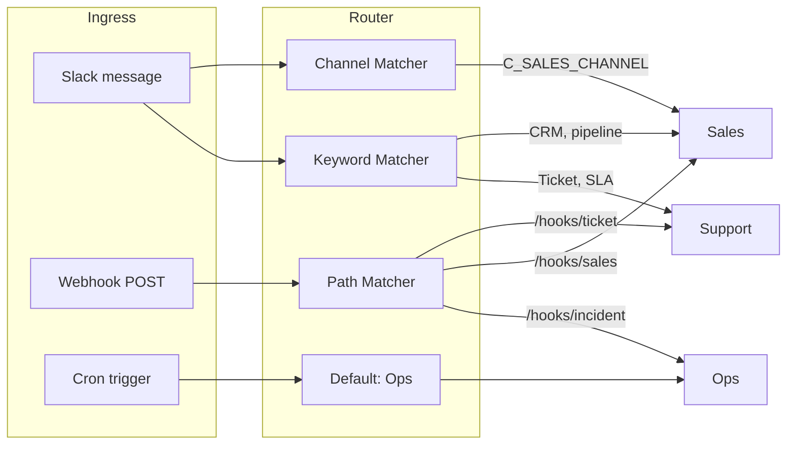
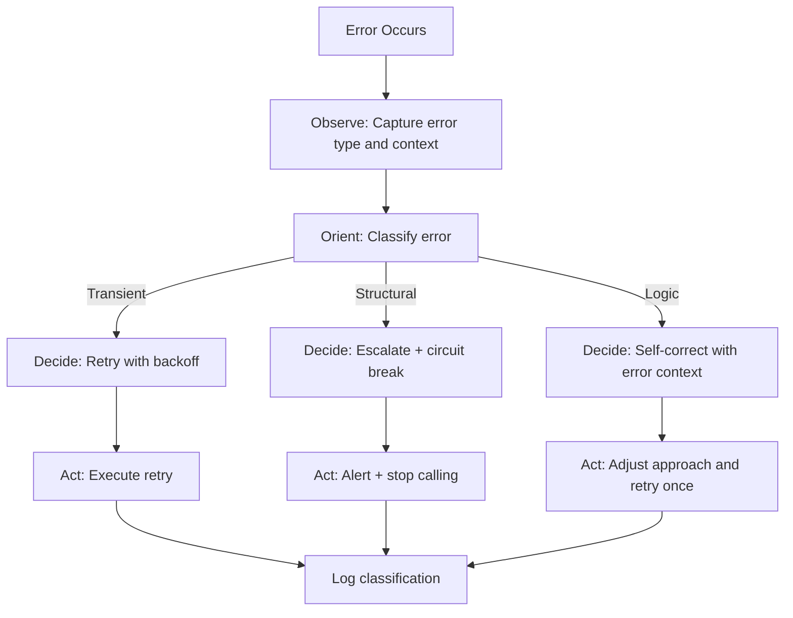
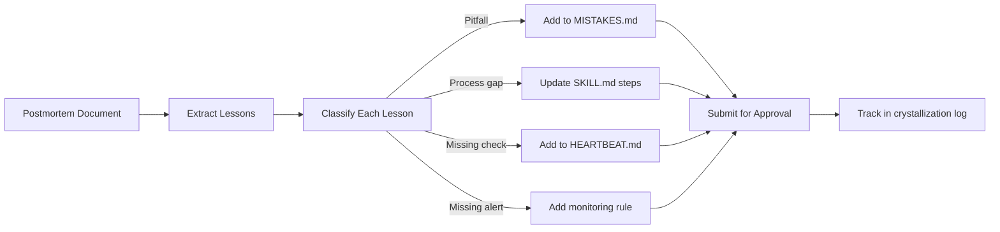
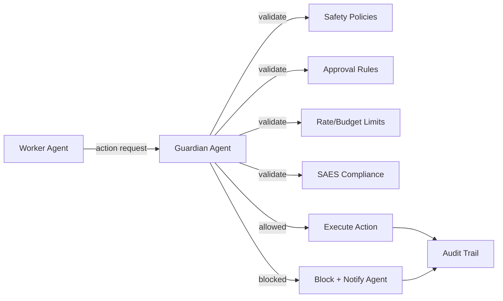

# MedinovAI Atlas Autonomous Agent Architecture

## A Design Pattern Reference for Building Self-Healing, Self-Improving Autonomous Systems

**Version**: 1.0.0
**Date**: 2026-02-14
**Audience**: AI agents, developers, and architects building autonomous products
**Purpose**: Training document -- extract and apply these patterns to make any product autonomous

---

# Part I: Foundation

---

## Chapter 1 -- Executive Summary

### What This Document Is

This document captures the architectural design patterns that allow MedinovAI Atlas -- a multi-agent operations automation platform -- to complete tasks, fix issues, and operate continuously **without requiring a human to guide each step**. It is written as a transferable playbook: every pattern here is designed to be extracted and applied to any software product to make it autonomous, reliable, self-healing, and self-improving.

### The Core Thesis

Autonomous agents do not require thousands of lines of procedural code. They require **declarative behavior specifications** -- concise documents that define identity, capabilities, safety boundaries, proactive behavior, and procedural skills. When combined with a structured set of reliability, self-healing, and self-improvement mechanisms, these specifications produce agents that:

1. **Complete tasks end-to-end** without waiting for human direction at each step
2. **Detect and recover from failures** using classified error handling and graduated fallback
3. **Learn from past mistakes** and adapt behavior over time
4. **Maintain safety boundaries** through pre-execution validation and approval gates
5. **Provide full observability** into what they did, why, and what happened

### The 20-Enhancement Mandate

The base MedinovAI Atlas architecture provides a strong foundation, but gap analysis revealed critical missing pieces in reliability, self-healing, and self-improvement. This document prescribes 20 specific enhancements organized into five layers:

- **Reliability Layer** (Enhancements 1-5): Prevent failures from cascading
- **Self-Healing Layer** (Enhancements 6-10): Detect and auto-correct problems
- **Self-Improvement Layer** (Enhancements 11-15): Learn from experience
- **Observability Layer** (Enhancements 16-18): See everything that happens
- **Intelligence Layer** (Enhancements 19-20): Remember and guard

Each enhancement follows a consistent format: **Gap** (what is missing) --> **Pattern** (how to fix it) --> **Specification** (concrete implementation).

---

## Chapter 2 -- Architectural Overview

### System Topology

MedinovAI Atlas is a **gateway-centric, multi-agent platform** with three ingress channels (Slack, webhooks, cron), a central gateway that routes work to specialized agents, and workspaces that define each agent's behavior declaratively.

```mermaid
flowchart TB
    subgraph ingress [Ingress Layer]
        Slack[Slack Socket Mode]
        Hooks[Webhooks /hooks/*]
        Cron[Cron Scheduler]
    end

    subgraph gateway [Gateway]
        Router[Signal Router]
        Sandbox[Exec Sandbox]
        Approval Pipeline[Approval Pipelines]
    end

    subgraph agents [Agent Layer]
        Ops[Ops Agent default]
        Sales[Sales Agent]
        Support[Support Agent]
        Finance[Finance Agent]
        Eng[Eng Agent]
    end

    subgraph enhanced [Enhanced Layer - New]
        Supervisor[Supervisor Meta-Agent]
        Guardian[Guardian Agent]
        Memory[Hindsight Memory]
        Observe[Observability Bus]
    end

    Slack --> Router
    Hooks --> Router
    Cron --> Router
    Router --> Ops
    Router --> Sales
    Router --> Support
    Router --> Finance
    Router --> Eng
    Ops -->|handoff| Sales
    Ops -->|handoff| Support
    Ops -->|handoff| Finance
    Ops -->|handoff| Eng
    Supervisor -.->|monitors| Ops
    Supervisor -.->|monitors| Sales
    Supervisor -.->|monitors| Support
    Guardian -.->|validates| Ops
    Guardian -.->|validates| Sales
    Guardian -.->|validates| Support
    Memory -.->|serves| Ops
    Memory -.->|serves| Sales
    Observe -.->|traces| Ops
    Observe -.->|traces| Sales
```

### The Five-File Workspace Model

Each agent's behavior is defined entirely by five types of files in its workspace:

| File | Purpose | Analogy |
|------|---------|---------|
| `AGENTS.md` | Identity, rules, handoff, error handling | Job description |
| `TOOLS.md` | Capabilities, safety boundaries, sandbox rules | Toolbox with safety manual |
| `SOUL.md` | Voice, tone, personality constraints | Communication style guide |
| `HEARTBEAT.md` | Proactive checks, suppression rules | Autonomous patrol schedule |
| `skills/*.md` | Procedural task definitions with I/O contracts | Standard operating procedures |

### Configuration-Driven Behavior

The gateway configuration (`atlas.json5`) controls runtime behavior without code changes:

```json5
{
  gateway: { port: 18789, bind: "loopback" },
  channels: { slack: { enabled: true, mode: "socket", dm: { policy: "pairing" } } },
  hooks: { enabled: true, mappings: [
    { match: { path: "ticket" }, action: "agent", agentId: "support" },
    { match: { path: "incident" }, action: "agent", agentId: "ops" },
  ]},
  cron: { enabled: true, maxConcurrentRuns: 2 },
  tools: { exec: { host: "sandbox", security: "allowlist", safeBins: ["python3", "node", "bash"] } },
  agents: {
    defaults: { model: "anthropic/claude-opus-4-6", timeoutSeconds: 1800,
      heartbeat: { every: "30m" },
      sandbox: { mode: "non-main", scope: "agent" }
    },
    list: [
      { id: "ops", default: true, workspace: "~/.atlas/workspace-ops" },
      { id: "sales", workspace: "~/.atlas/workspace-sales" },
      { id: "support", workspace: "~/.atlas/workspace-support" },
      { id: "finance", workspace: "~/.atlas/workspace-finance" },
      { id: "eng", workspace: "~/.atlas/workspace-eng" },
    ]
  }
}
```

**Key principle**: Behavior changes do not require code deployments. Change a markdown file or config value, and the agent's behavior changes immediately.

---

# Part II: Core Design Patterns

---

## Chapter 3 -- The Five-File Agent Specification Pattern

### Pattern Summary

An autonomous agent is fully defined by five declarative documents. No procedural code is required to specify agent behavior -- the LLM interprets these documents as its operating instructions.

### File 1: AGENTS.md (Identity and Rules)

Defines who the agent is, what it does, and how it interacts with other agents.

```markdown
# Ops Agent -- Operating Rules

You are the **Ops agent**, the default catch-all automation agent.

## Identity
- You handle operations, internal helpdesk, daily briefings, incident coordination.
- When a request belongs to another department, hand off using `sessions_send`.

## Core Behaviors
1. Structured output first. Always return JSON when downstream systems expect it.
2. Log everything. Write to `workspace/logs/` as JSONL with ISO-8601 timestamps.
3. Ask before acting on side effects. Request approval for email, money, permissions, deploys.
4. Be concise. Slack messages scannable in < 15 seconds.
5. Cite sources. Include URL or system of record.

## Handoff Rules
| Signal                              | Route to        |
|-------------------------------------|-----------------|
| CRM, pipeline, deal, prospect       | `sales` agent   |
| Ticket, SLA, customer issue         | `support` agent |
| Invoice, expense, budget, runway    | `finance` agent |
| PR, CI, deploy, dependency          | `eng` agent     |

## Error Handling
- On failure: `{"status": "error", "error": "<description>", "suggested_action": "..."}`
- On uncertainty: `{"status": "needs_human", "questions": ["..."]}`
- Never silently swallow errors.
```

**Why this works**: The agent has a clear identity, knows when to act vs. hand off, has explicit error handling rules, and has a structured output contract. It does not need a human to tell it "now log this" or "now hand off to sales" -- the rules are already embedded.

### File 2: TOOLS.md (Capabilities and Safety)

Defines what tools the agent can use and the safety boundaries around them.

```markdown
# Ops Agent -- Tool Rules & Safety

## General Tool Policy
- Sandbox by default. All `exec` calls run in sandbox.
- JSON in, JSON out. Scripts accept `--json-in` on stdin and output JSON to stdout.
- Timeout awareness. Web fetches: 30s. Exec calls: 60s.

## Exec Tool
- Allowed binaries: `python3`, `node`, `bash`
- Never execute host-modifying commands (no `rm -rf`, no `sudo`).

## Approval Pipelines
- Use for any multi-step workflow with side effects.
- Always include an approval gate before: send, publish, deploy, pay, delete.
```

**Why this works**: The agent knows its capabilities AND its limits. It will not attempt to use tools it should not, and it will not bypass safety constraints.

### File 3: SOUL.md (Personality and Constraints)

Defines how the agent communicates -- tone, formatting, and anti-patterns.

```markdown
# Ops Agent -- Voice & Tone

## Personality
- Professional but approachable. Reliable operations partner, not a chatbot.
- Concise and clear. Lead with the answer, then supporting detail.
- Confident when you know, honest when you don't. Never bluff.

## What You Never Do
- Never use corporate jargon ("synergy", "leverage", "circle back").
- Never apologize excessively.
- Never speculate without labeling it as speculation.
```

**Why this works**: Consistent, trustworthy communication without human coaching on every message.

### File 4: HEARTBEAT.md (Proactive Behavior)

Defines what the agent does autonomously on a schedule -- without any human trigger.

```markdown
# Ops Agent -- Heartbeat Checks

Run these checks every 30 minutes. Only alert when something needs attention.

## Checks
1. Calendar conflicts (next 2 hours) -- flag double-bookings
2. Inbox priority scan -- summarize VIP emails
3. Open incident check -- nudge if > 1 hour without update
4. Cron job health -- alert if any job failed
5. Pending approvals -- nudge if waiting > 30 minutes

## Suppression Rules
- Do NOT alert if all checks pass (silence = healthy).
- Do NOT re-alert on same issue within 1 hour.
```

**Why this works**: The agent works proactively without triggers. It self-suppresses noise. Silence means healthy.

### File 5: SKILL.md (Procedural Tasks)

Defines specific tasks with inputs, outputs, failure modes, and step-by-step instructions.

```yaml
---
name: daily-brief
description: Generate daily executive briefing from KPIs, calendar, and incidents.
inputs:
  - kpi_json (from scripts/kpi_snapshot.py)
  - calendar_events (from Calendar API)
  - incident_status (from incident tracker)
outputs:
  - Formatted briefing posted to #exec Slack channel
  - Raw JSON stored in workspace/outputs/briefs/
failure_modes:
  - KPI script fails -> partial brief with "[KPI data unavailable]" placeholder
  - Calendar API unreachable -> skip calendar section with note
  - All sources fail -> post "Briefing generation failed" with error details
requires_approval: false
---
```

**Why this works**: The skill defines everything the agent needs: what it receives, what it produces, how it fails gracefully, and whether it needs approval. The LLM interprets the step-by-step instructions as its execution plan.

### Generalizable Principle

**Any autonomous agent in any product can be fully specified using these five files.** The content changes per domain, but the pattern is universal.

---

## Chapter 4 -- Signal-Based Routing and Multi-Agent Handoff

### The Routing Pattern

Work enters the system through three channels and is routed to the correct agent based on signal matching:



**Three routing mechanisms**:

1. **Path-based** (webhooks): URL path determines agent (`/hooks/ticket` -> support)
2. **Channel-based** (Slack): Channel ID maps to agent via bindings
3. **Keyword-based** (handoff): Signal words in content trigger handoff between agents

**The catch-all default pattern**: One agent (ops) is marked `default: true` and receives everything that does not match a specific route. This ensures no work is lost.

### Structured Handoff Protocol

When Agent A determines work belongs to Agent B:

1. Agent A identifies signal keywords in the request
2. Agent A uses `sessions_send` to transfer the session to Agent B
3. Agent A includes structured context: `{ reason, original_request, relevant_data }`
4. Agent B receives the session with full context and continues

**Key rule**: Handoffs must include enough context for the receiving agent to act without asking the user to repeat themselves.

---

## Chapter 5 -- Skill Architecture

### The Three Skill Archetypes

Every autonomous task falls into one of three categories:

**Archetype 1: Scheduled (Cron-Driven)**
- Example: Daily briefing
- Trigger: Time-based cron schedule
- Characteristic: Runs without any human trigger. Gathers data, synthesizes, delivers.

**Archetype 2: Reactive (Event-Driven from Human Action)**
- Example: Taskify (Slack reaction -> ticket)
- Trigger: Human adds a reaction to a Slack message
- Characteristic: Responds to a lightweight human signal, then completes autonomously.

**Archetype 3: Event-Driven (System Event)**
- Example: Incident response
- Trigger: Webhook from monitoring system or `/incident open` command
- Characteristic: Enters a long-running lifecycle with periodic autonomous updates.

### YAML Front Matter Contract

Every skill declares its contract in YAML front matter:

```yaml
---
name: <skill_name>
description: <one-line description>
inputs:
  - <input_name> (<source>)
outputs:
  - <output_description>
failure_modes:
  - <condition> -> <fallback_behavior>
requires_approval: true|false
---
```

This contract enables:
- **Autonomous chaining**: Skills can call other skills by matching output to input contracts
- **Graceful degradation**: Failure modes are pre-defined, not improvised
- **Safety gates**: Approval requirements are declared, not remembered

---

## Chapter 6 -- Structured I/O Contracts

### The Status Tri-State

Every response from every agent and script follows a three-state contract:

```json
{ "status": "ok", "data": { ... } }
{ "status": "error", "error": "description", "suggested_action": "what to try" }
{ "status": "needs_human", "questions": ["What should I prioritize?", "..."] }
```

**Why three states and not two**: The `needs_human` state is critical. It means the agent is not broken -- it is working correctly but has identified a situation where human judgment is required. This is fundamentally different from an error.

### JSON-In, JSON-Out for Scripts

All scripts follow the same I/O contract:

```bash
# Input: JSON on stdin (optional)
echo '{"sources": ["revenue"]}' | python3 kpi_snapshot.py --json-in

# Output: JSON on stdout (always)
{
  "status": "ok",
  "generated_at": "2026-02-14T08:00:00Z",
  "kpis": [...],
  "fires": [],
  "metadata": { "version": "1.0.0" }
}
```

**Why this matters**: Structured I/O enables autonomous chaining. Agent A runs Script 1, parses the JSON output, feeds it to Script 2 or renders it with a template -- all without human interpretation.

### Template-Driven Output

Templates use Handlebars-style rendering:

```markdown
# Daily Executive Briefing -- {{date}}

## Key Metrics
| Metric | Value | Trend | Status |
|--------|-------|-------|--------|
{{#each kpis}}
| {{name}} | {{value}} | {{trend}} | {{status}} |
{{/each}}

## Fires to Fight
{{#if fires}}
{{#each fires}}
- **{{severity}}** -- {{description}} (owner: {{owner}})
{{/each}}
{{else}}
- No active incidents or escalations.
{{/if}}
```

**Principle**: Separate data from presentation. The agent gathers data, the template handles formatting. This makes outputs consistent and auditable.

---

# Part III: The 20 Enhancements

---

## Chapter 7 -- Reliability Layer (Enhancements 1-5)

### Enhancement 1: Circuit Breaker Pattern

**Gap**: No protection against cascading failures when external APIs (CRM, ticketing, billing, Calendar) go down. Agents keep calling failing endpoints, wasting time and tokens.

**Pattern**: Three-state circuit breaker per external dependency.

```
CLOSED (normal) --[N failures in window]--> OPEN (stop calls, use fallback)
OPEN --[reset timeout expires]--> HALF-OPEN (probe with single request)
HALF-OPEN --[probe succeeds]--> CLOSED
HALF-OPEN --[probe fails]--> OPEN
```

**Specification**:

```json5
// In tool or skill configuration
circuit_breaker: {
  ticketing_api: { failureThreshold: 5, windowSeconds: 60, resetTimeout: "5m" },
  crm_api:      { failureThreshold: 3, windowSeconds: 30, resetTimeout: "3m" },
  calendar_api:  { failureThreshold: 3, windowSeconds: 30, resetTimeout: "3m" },
}
```

State tracked in `state/circuit_breakers.json`:

```json
{
  "ticketing_api": { "state": "closed", "failures": 0, "last_failure": null, "opened_at": null },
  "crm_api": { "state": "open", "failures": 5, "last_failure": "2026-02-14T08:15:00Z", "opened_at": "2026-02-14T08:15:00Z" }
}
```

**Fallback behavior**: When circuit is open, queue the request locally in `state/queued_requests/` and serve cached data if available. When circuit closes, drain the queue.

---

### Enhancement 2: Exponential Backoff with Jitter

**Gap**: Skills mention "retry" but never specify how many times, how long to wait, or how to avoid thundering herd.

**Pattern**: Exponential backoff with decorrelated jitter. Dead-letter after exhaustion.

**Specification**:

```json5
retry: {
  maxRetries: 5,
  baseDelay: "1s",
  maxDelay: "60s",
  jitter: "decorrelated",  // delay = random(baseDelay, previousDelay * 3)
  deadLetter: "state/dead_letter/"
}
```

**Algorithm** (pseudocode):

```
delay = baseDelay
for attempt in 1..maxRetries:
    result = execute(action)
    if result.status == "ok": return result
    delay = min(maxDelay, random(baseDelay, delay * 3))
    sleep(delay)
// All retries exhausted
write_to_dead_letter(action, last_error)
return { status: "error", error: "max retries exceeded", suggested_action: "check dead letter queue" }
```

---

### Enhancement 3: Idempotency Keys

**Gap**: Webhooks and task creation have no deduplication. A retry or duplicate webhook can create duplicate tickets.

**Pattern**: Derive an idempotency key from the source. Check before acting.

**Specification**:

- Taskify: key = `sha256(source_message_link)`
- Webhooks: key = `sha256(payload_body)`
- Keys stored in `state/idempotency_keys.json` with 24-hour TTL

```json
{
  "keys": {
    "a1b2c3d4": { "created": "2026-02-14T08:00:00Z", "result_ref": "outputs/tasks/2026-02-14/TASK-123.json" },
  },
  "ttl_hours": 24
}
```

**Behavior**: On key collision, return the existing result instead of re-executing. Heartbeat cleans expired keys.

---

### Enhancement 4: Checkpointed Workflow Execution

**Gap**: Multi-step skills restart from scratch on any mid-execution failure.

**Pattern**: Persist state after each step. Resume from last successful checkpoint.

**Specification**:

Add to skill front matter:

```yaml
checkpoints: true
```

State stored in `state/checkpoints/<skill>/<execution_id>.json`:

```json
{
  "execution_id": "daily-brief-2026-02-14",
  "started_at": "2026-02-14T08:00:00Z",
  "steps": [
    { "id": 1, "name": "fetch_kpis", "status": "completed", "data": { "kpis": [...] } },
    { "id": 2, "name": "fetch_calendar", "status": "completed", "data": { "events": [...] } },
    { "id": 3, "name": "check_incidents", "status": "failed", "error": "API timeout" }
  ]
}
```

**Resume logic**: On re-execution, load checkpoint. Skip completed steps (use cached data). Retry from failed step. After full success, delete checkpoint.

---

### Enhancement 5: Health Endpoint and Readiness Probes

**Gap**: No way for external systems to know if MedinovAI Atlas is alive and ready.

**Pattern**: Standard health/ready probes.

**Specification**:

```json5
health: {
  enabled: true,
  path: "/health",     // 200 if gateway is alive
  readyPath: "/ready", // 200 if all critical dependencies reachable
}
```

`GET /health` response:

```json
{ "status": "ok", "uptime_seconds": 86400, "agents_active": 5 }
```

`GET /ready` checks: Slack connection, model API, critical state files. Returns 503 if any fail.

---

## Chapter 8 -- Self-Healing Layer (Enhancements 6-10)

### Enhancement 6: OODA Self-Diagnosis Loop

**Gap**: Agents treat all errors the same. A network timeout and a logic bug get the same response.

**Pattern**: Observe-Orient-Decide-Act loop for error classification and recovery.



**Classification rules**:

- **Transient**: HTTP 429, 502, 503, timeout, connection reset --> retry with backoff
- **Structural**: HTTP 401, 403, schema mismatch, missing config --> escalate, do not retry
- **Logic**: Unexpected output format, hallucinated data, constraint violation --> self-correct by feeding error back into context and retrying once

**Specification for AGENTS.md**:

```markdown
## Self-Diagnosis Protocol (OODA)
On any error:
1. **Observe**: Capture error type, HTTP status, error message, and last 3 actions.
2. **Orient**: Classify as `transient` (retry), `structural` (escalate), or `logic` (self-correct).
3. **Decide**: Apply recovery strategy for the classification.
4. **Act**: Execute. Log the classification and outcome to `workspace/logs/`.
```

---

### Enhancement 7: Supervisor Meta-Agent

**Gap**: No mechanism detects agents stuck in infinite loops, repeated failures, or oscillating behavior.

**Pattern**: A lightweight Supervisor monitors all Worker agents and intervenes when behavior is abnormal.

**Detection rules**:

1. **Doom loop**: Same action attempted 3+ times with identical parameters
2. **Stall**: Execution exceeds 2x expected duration for the skill
3. **Oscillation**: Agent alternates between two states more than 4 times

**Intervention protocol**:

1. Kill the stuck thread
2. Log the intervention with full context
3. Try an alternate strategy (different tool, different approach)
4. If alternate also fails, escalate with `needs_human`

**Specification**:

```json5
// In agents list
{ id: "supervisor", workspace: "~/.atlas/workspace-supervisor" }
```

Supervisor checks `workspace/logs/` from all agents every 5 minutes. Tracks interventions in `state/supervisor/interventions.json`.

---

### Enhancement 8: Heartbeat Remediation

**Gap**: Heartbeat checks detect problems but only alert. They never fix anything.

**Pattern**: Pair every detection with a remediation action. Detect -> Fix -> Verify -> Alert only if fix fails.

**Specification** (enhanced HEARTBEAT.md):

| Check | Detection | Remediation | Verify | Alert If |
|-------|-----------|-------------|--------|----------|
| Cron job failed | Job status = failed | Auto-retry the job | Check new status | Retry also failed |
| Stale incident | No update > 1h | Post nudge + create follow-up task | Check for response in 15m | Still no response |
| Pending approval | Waiting > 30m | Nudge approver DM | Check for response in 15m | Waiting > 2h: escalate to backup |
| Calendar conflict | Double-booking found | Draft resolution options | N/A | Always alert with options |
| Dead letter items | Items > 24h old | Group and classify | N/A | Surface to relevant agent |

**Key principle**: Alert is the last resort, not the first action.

---

### Enhancement 9: Quality Rollback

**Gap**: No detection of output quality degradation. Agent could produce incomplete or generic output indefinitely.

**Pattern**: Score every output against expected completeness. Roll back on consecutive failures.

**Specification**:

Add to skill front matter:

```yaml
quality_gate:
  min_completeness: 0.8
  required_fields: ["kpis", "priorities", "calendar"]
  consecutive_failures_to_rollback: 3
```

**Scoring algorithm**:

```
completeness = (present_required_fields / total_required_fields)
if completeness < min_completeness:
  increment failure_counter
  if failure_counter >= consecutive_failures_to_rollback:
    rollback to previous skill version
    reset failure_counter
    alert: "Quality degradation detected, rolled back to version N-1"
else:
  reset failure_counter
```

---

### Enhancement 10: Dead Letter Queue with Auto-Triage

**Gap**: Operations that fail after all retries are silently lost.

**Pattern**: Dead-letter queue with heartbeat-driven triage.

**Specification**:

Dead letter entry format (`state/dead_letter/<id>.json`):

```json
{
  "id": "dl-20260214-001",
  "skill": "taskify",
  "step": "create_ticket",
  "error": "Ticketing API returned 500",
  "payload": { "title": "Fix login bug", "owner": "eng-lead" },
  "attempts": 5,
  "first_failed": "2026-02-14T08:00:00Z",
  "last_failed": "2026-02-14T08:05:30Z"
}
```

**Triage rules** (run every heartbeat):
1. Group dead letters by error type
2. For each group, suggest a fix
3. If item is > 24h old, surface to human via Slack with summary
4. If item is > 72h old, mark as `abandoned` and archive

---

## Chapter 9 -- Self-Improvement Layer (Enhancements 11-15)

### Enhancement 11: Mistake Notebook

**Gap**: Agents repeat the same mistakes. Postmortems are written but never consulted.

**Pattern**: Structured failure memory injected into agent context before execution.

**Specification**:

File: `workspaces/<agent>/MISTAKES.md` (auto-populated, human-reviewable)

```markdown
# Known Mistakes and Pitfalls

## MSTK-001: SSO accounts cannot reset passwords
- **Pattern**: User asks about password reset
- **Pitfall**: Suggesting password reset flow for SSO-only accounts
- **Avoidance**: Check if account is SSO-linked before suggesting password reset
- **Frequency**: 3 occurrences
- **Last seen**: 2026-02-10

## MSTK-002: Service X depends on Service Y
- **Pattern**: Restarting Service X during incident
- **Pitfall**: Restarting X without checking Y causes cascade failure
- **Avoidance**: Always verify Service Y health before restarting Service X
- **Frequency**: 1 occurrence
- **Last seen**: 2026-02-05
```

**Injection protocol**: Before each skill execution, retrieve the top 3 relevant mistake notes (by keyword match to current task context). Inject as "Known Pitfalls -- review before proceeding" in the prompt.

---

### Enhancement 12: Outcome Tracking and Closed-Loop Verification

**Gap**: Fire-and-forget. No tracking of whether actions achieved their intended outcome.

**Pattern**: Schedule verification checks after every action with a measurable outcome.

**Specification**:

Add to skill front matter:

```yaml
verify_after:
  delay: "48h"
  check: "ticket_status != stale"
  on_failure: "create_follow_up_task"
```

**Verification schedule**:

| Skill | Verification | Timing | On Failure |
|-------|-------------|--------|------------|
| Taskify | Is ticket in progress? | 48h after creation | Create follow-up nudge task |
| Incident | Was postmortem completed? | 24h after close | Nudge incident commander |
| Daily-brief | Were flagged priorities addressed? | Next day | Highlight as carryover |

Results stored in `outputs/outcomes/<date>.json`:

```json
{
  "verifications": [
    { "skill": "taskify", "action_id": "TASK-123", "expected": "in_progress", "actual": "stale", "result": "failed", "follow_up": "TASK-456" }
  ]
}
```

---

### Enhancement 13: Human Feedback Capture

**Gap**: No mechanism for humans to rate or correct agent outputs.

**Pattern**: Reaction-based feedback on Slack deliverables plus correction threads.

**Specification**:

After every Slack-delivered output, agent appends:

```
React :thumbsup: if helpful, :thumbsdown: if not.
```

On thumbsdown reaction:
1. Agent opens thread: "What should I have done differently?"
2. Human responds with correction
3. Agent stores feedback:

```json
{
  "output_id": "brief-2026-02-14",
  "skill": "daily-brief",
  "rating": "negative",
  "correction": "You missed the pipeline metric that changed by 20%",
  "timestamp": "2026-02-14T09:30:00Z"
}
```

**Weekly digest**: Every Monday, agent summarizes negative feedback patterns and proposes adjustments to its own behavior.

---

### Enhancement 14: Adaptive Threshold Tuning

**Gap**: All thresholds (1h suppression, 30m heartbeat, 15m incident updates, 60% confidence) are static. No adaptation to actual patterns.

**Pattern**: Track historical data. Compute optimal thresholds. Auto-apply within safe bounds.

**Specification**:

State tracked in `state/thresholds.json`:

```json
{
  "incident_nudge_hours": {
    "current": 1.0,
    "history": [1.0, 1.0, 0.75, 0.8, 0.75],
    "computed_optimal": 0.83,
    "safe_bounds": [0.5, 2.0],
    "last_adjusted": "2026-02-10T00:00:00Z"
  },
  "support_confidence_threshold": {
    "current": 0.6,
    "history": [0.6, 0.6, 0.6],
    "computed_optimal": 0.55,
    "safe_bounds": [0.4, 0.9],
    "last_adjusted": null
  }
}
```

**Rules**:
- Compute optimal from running median of last 30 data points
- Auto-apply if within safe bounds
- Require human approval if outside safe bounds
- All changes logged and reversible

---

### Enhancement 15: Postmortem-to-Runbook Pipeline

**Gap**: Postmortems are write-only documents. Lessons never flow back into operational behavior.

**Pattern**: After each postmortem, extract action items and crystallize them into operational improvements.



**Specification**:

Triggered automatically when a postmortem file is finalized. Steps:

1. Parse postmortem for "Lessons Learned" and "Action Items" sections
2. For each item, classify as: mistake-note, skill-update, heartbeat-check, or monitoring-rule
3. Generate draft updates for the appropriate files
4. Submit drafts for human approval via Approval Pipeline
5. On approval, apply changes
6. Track in `state/crystallization_log.json`

---

## Chapter 10 -- Observability Layer (Enhancements 16-18)

### Enhancement 16: Five-Pillar Agent Observability

**Gap**: Only `logging: { level: "info" }` exists. No structured tracing, metrics, or evaluation.

**Pattern**: Five observability pillars for complete visibility.

**The Five Pillars**:

1. **Traces**: Correlation IDs across skills, tools, and agents. Every execution gets a `trace_id`.
2. **Operational Telemetry**: Latency, token usage, error rates per skill/agent.
3. **Cognitive Telemetry**: Reasoning steps, confidence scores, decision points.
4. **Contextual Snapshots**: State of inputs and outputs at each step.
5. **Evaluation Signals**: Sampled quality checks, feedback scores, SLO compliance.

**Specification**:

Every step logs:

```json
{
  "trace_id": "tr-20260214-abc123",
  "agent": "ops",
  "skill": "daily-brief",
  "step": 3,
  "step_name": "check_incidents",
  "duration_ms": 1200,
  "tokens_used": 450,
  "confidence": 0.92,
  "outcome": "ok",
  "timestamp": "2026-02-14T08:00:01.200Z"
}
```

**Aggregation** (every heartbeat):

```json
{
  "date": "2026-02-14",
  "total_executions": 47,
  "error_rate": 0.04,
  "p95_latency_ms": 8500,
  "total_tokens": 125000,
  "feedback_score_avg": 0.87
}
```

**Alerts**: error_rate > 10%, p95_latency > 30s, token_cost > daily_budget.

---

### Enhancement 17: SLO/SLI Definitions per Skill

**Gap**: No defined service level objectives. No way to measure if the system meets expectations.

**Pattern**: SLIs (what to measure) and SLOs (targets) per skill.

**Specification**:

Add to skill front matter:

```yaml
slo:
  availability: "99%"       # Skill executes successfully 99% of the time
  latency_p95: "60s"        # 95th percentile execution under 60 seconds
  completeness: "95%"       # All required fields present 95% of the time
```

**Tracking** (`state/slo/daily.json`):

```json
{
  "daily-brief": {
    "availability": { "target": 0.99, "actual_30d": 0.97, "burn_rate": 1.5 },
    "latency_p95": { "target_ms": 60000, "actual_30d_ms": 45000, "status": "ok" },
    "completeness": { "target": 0.95, "actual_30d": 0.93, "status": "warning" }
  }
}
```

**Alert on**: burn_rate > 2x (burning through error budget too fast).

---

### Enhancement 18: Tamper-Proof Audit Trail

**Gap**: Logs exist but have no integrity guarantees. No compliance-ready format.

**Pattern**: Append-only, hash-chained audit log.

**Specification**:

Each entry in `workspace/audit/audit.jsonl`:

```json
{
  "seq": 1042,
  "prev_hash": "sha256:abc123...",
  "timestamp": "2026-02-14T08:00:00Z",
  "agent": "ops",
  "action": "create_ticket",
  "target": "TASK-123",
  "approval_id": "lobster-456",
  "outcome": "ok",
  "hash": "sha256:def789..."
}
```

**Integrity rules**:
- `hash = sha256(seq + prev_hash + timestamp + agent + action + target + outcome)`
- Chain verified every heartbeat cycle
- Broken chain = immediate alert + investigation
- Satisfies SAES audit requirements

---

## Chapter 11 -- Intelligence Layer (Enhancements 19-20)

### Enhancement 19: Hindsight Memory Architecture

**Gap**: Every session starts from zero. No cross-session learning.

**Pattern**: Four memory networks with three operations (Retain, Recall, Reflect).

**The Four Networks**:

1. **World Facts**: Company knowledge, system configs, org structure. Stable, rarely changes.
2. **Agent Experiences**: Past executions, outcomes, errors. Grows with every session.
3. **Entity Summaries**: People, systems, recurring issues. Updated as entities evolve.
4. **Evolving Beliefs**: Hypotheses about what works and what does not. Refined over time.

**The Three Operations**:

- **Retain** (after each session): Extract key facts and outcomes. Store in appropriate network.
- **Recall** (before each session): Retrieve relevant memories by similarity to current task.
- **Reflect** (weekly): Review accumulated experiences. Update beliefs. Prune outdated facts.

**Specification**:

```json5
memory: {
  enabled: true,
  networks: {
    world:       "state/memory/world.json",
    experiences: "state/memory/experiences.json",
    entities:    "state/memory/entities.json",
    beliefs:     "state/memory/beliefs.json",
  },
  retain_after_session: true,
  recall_top_k: 5,
  reflect_schedule: "weekly",
  tenant_scoped: true,   // SAES compliance: no cross-tenant memory
}
```

**Critical safety rule**: All memory is tenant-scoped. No PHI/PII stored in memory. Redact before retention per SAES rules.

---

### Enhancement 20: Guardian Agent

**Gap**: Approval gates exist for some actions, but there is no systematic pre-execution validation of ALL actions.

**Pattern**: A Guardian agent validates every action against policy, safety, and consistency before execution.



**Specification**:

Guardian receives:

```json
{
  "agent": "ops",
  "action": "send_email",
  "target": "external@example.com",
  "params": { "subject": "...", "body": "..." },
  "context": { "skill": "incident", "trace_id": "tr-abc123" }
}
```

Guardian returns:

```json
{
  "allowed": false,
  "reason": "External email requires human approval per AGENTS.md",
  "required_approval": "lobster",
  "violations": ["approval_required:external_email"]
}
```

**Validation checks**:
1. Safety policies (TOOLS.md): Is the action within allowed capabilities?
2. Approval requirements (AGENTS.md): Does this action require approval?
3. Consistency: Does this contradict a recent action by the same agent?
4. Budget/rate limits: Has the agent exceeded its token/action budget?
5. SAES compliance: Does the action involve PHI/PII? Is tenant isolation maintained?

**Performance target**: < 500ms per validation. Guardian never blocks on its own failures -- if Guardian is down, actions proceed with a warning logged.

---

# Part IV: Generalization Framework

---

## Chapter 12 -- The Complete Autonomous Agent Blueprint

Use this template to make any new product autonomous. Copy these files into the product's workspace and customize the content.

### Template: AGENTS.md

```markdown
# [Agent Name] -- Operating Rules

You are the **[Agent Name]** agent for [product/domain].

## Identity
- You handle [primary responsibilities].
- When a request belongs to another area, hand off using [handoff mechanism].

## Core Behaviors
1. Structured output first. Return JSON when downstream systems expect it.
2. Log everything. JSONL with ISO-8601 timestamps to `workspace/logs/`.
3. Ask before acting on side effects. Request approval for [list side effects].
4. Apply the OODA self-diagnosis protocol on every error.
5. Check MISTAKES.md before executing skills.

## Handoff Rules
| Signal | Route to |
|--------|----------|
| [keywords] | [target agent] |

## Error Handling
- On failure: `{"status": "error", "error": "...", "suggested_action": "..."}`
- On uncertainty: `{"status": "needs_human", "questions": [...]}`
- Never silently swallow errors.

## Self-Diagnosis Protocol (OODA)
1. Observe: Capture error type, context, recent actions.
2. Orient: Classify as transient | structural | logic.
3. Decide: transient=retry, structural=escalate, logic=self-correct.
4. Act: Execute and log classification.
```

### Template: TOOLS.md

```markdown
# [Agent Name] -- Tool Rules & Safety

## General Policy
- Sandbox by default.
- JSON in, JSON out.
- Circuit breaker: stop calling a failing service after [N] consecutive failures.
- Retry policy: exponential backoff, max [N] retries, dead-letter after exhaustion.
- Idempotency: check before creating. Use source-derived keys.

## Allowed Tools
- [List tools and binaries]

## Approval Gates
- Always require approval before: [send, publish, deploy, pay, delete]
```

### Template: HEARTBEAT.md

```markdown
# [Agent Name] -- Heartbeat Checks

Run every [interval]. Only alert when something needs attention.

## Checks

### 1. [Check Name]
- **Detect**: [what to look for]
- **Remediate**: [auto-fix action]
- **Verify**: [how to confirm fix worked]
- **Alert if**: [remediation failed]

### 2. Dead Letter Triage
- Check `state/dead_letter/` for items > 24h
- Group by error type, suggest fix, surface to human

### 3. SLO Burn Rate
- Check `state/slo/` for burn_rate > 2x
- Alert with specific skill and metric

## Suppression Rules
- Silence = healthy. Do not alert if all checks pass.
- Do not re-alert on same issue within [window].
```

### Template: SKILL.md

```yaml
---
name: [skill_name]
description: [one-line]
inputs:
  - [input] ([source])
outputs:
  - [output description]
failure_modes:
  - [condition] -> [fallback]
requires_approval: true|false
checkpoints: true
quality_gate:
  min_completeness: 0.8
  required_fields: [...]
  consecutive_failures_to_rollback: 3
verify_after:
  delay: "[time]"
  check: "[condition]"
  on_failure: "[action]"
slo:
  availability: "[target]"
  latency_p95: "[target]"
---
```

---

## Chapter 13 -- Cross-Product Application Matrix

### Domain Adaptation Guide

| MedinovAI Atlas Concept | Clinical Product | Engineering Product | Customer Success |
|-----------------|-----------------|-------------------|-----------------|
| Ops Agent | Clinical Coordinator | DevOps Agent | CS Manager Agent |
| Sales Agent | Patient Outreach Agent | N/A | Upsell Agent |
| Support Agent | Patient Support Agent | Incident Responder | Tier 1 Support |
| Finance Agent | Billing Agent | Cost Optimizer | Revenue Agent |
| Eng Agent | Lab Systems Agent | Core Eng Agent | Integration Agent |
| Incident Skill | Adverse Event Skill | Production Incident | Churn Alert Skill |
| Daily Brief | Clinical Dashboard | Sprint Summary | Portfolio Health |
| Taskify | Order Entry | Issue Creation | Action Item Tracker |
| Heartbeat Checks | Lab Equipment Health | CI/CD Pipeline Health | Account Health Scores |
| Circuit Breaker | EHR API Failover | Cloud API Failover | CRM API Failover |
| Mistake Notebook | Clinical Protocol Deviations | Production Incident Patterns | Customer Complaint Patterns |
| Guardian Agent | PHI Access Validator | Security Policy Gate | Data Privacy Gate |

### Implementation Priority Decision Matrix

When adopting these patterns for a new product, implement in this order:

**Phase 1 -- Foundation (Week 1-2)**
1. Five-file workspace structure (AGENTS, TOOLS, SOUL, HEARTBEAT, SKILL)
2. Structured I/O contracts (status tri-state)
3. Basic error handling (never swallow errors)

**Phase 2 -- Reliability (Week 3-4)**
4. Retry with exponential backoff
5. Circuit breakers for external dependencies
6. Idempotency keys
7. Health probes

**Phase 3 -- Self-Healing (Week 5-6)**
8. OODA self-diagnosis
9. Heartbeat remediation (not just detection)
10. Dead letter queue
11. Checkpointed workflows

**Phase 4 -- Observability (Week 7-8)**
12. Five-pillar tracing
13. SLO/SLI definitions
14. Audit trail

**Phase 5 -- Self-Improvement (Week 9-10)**
15. Mistake notebook
16. Human feedback capture
17. Outcome tracking
18. Quality gates with rollback

**Phase 6 -- Intelligence (Week 11-12)**
19. Hindsight memory
20. Guardian agent
21. Adaptive threshold tuning
22. Postmortem-to-runbook pipeline
23. Supervisor meta-agent

---

## Appendix A -- Enhancement Implementation Priority Matrix

| # | Enhancement | Effort | Impact | Priority |
|---|-------------|--------|--------|----------|
| 1 | Circuit Breaker | Low | High | P0 |
| 2 | Exponential Backoff | Low | High | P0 |
| 3 | Idempotency Keys | Low | Medium | P1 |
| 4 | Checkpointed Workflows | Medium | High | P1 |
| 5 | Health Probes | Low | Medium | P1 |
| 6 | OODA Self-Diagnosis | Low | High | P0 |
| 7 | Supervisor Meta-Agent | High | High | P2 |
| 8 | Heartbeat Remediation | Medium | High | P1 |
| 9 | Quality Rollback | Medium | Medium | P2 |
| 10 | Dead Letter Queue | Low | Medium | P1 |
| 11 | Mistake Notebook | Medium | High | P1 |
| 12 | Outcome Tracking | Medium | High | P1 |
| 13 | Human Feedback | Low | Medium | P2 |
| 14 | Adaptive Thresholds | High | Medium | P3 |
| 15 | Postmortem Pipeline | Medium | High | P2 |
| 16 | Five-Pillar Observability | High | High | P1 |
| 17 | SLO/SLI | Medium | Medium | P2 |
| 18 | Tamper-Proof Audit | Medium | High | P1 |
| 19 | Hindsight Memory | High | High | P2 |
| 20 | Guardian Agent | High | High | P2 |

---

## Appendix B -- 25-Item Quick-Start Checklist

### Foundation
- [ ] 1. Create `AGENTS.md` with identity, behaviors, handoff rules, error handling
- [ ] 2. Create `TOOLS.md` with allowed tools, safety boundaries, approval gates
- [ ] 3. Create `SOUL.md` with voice, tone, and anti-patterns
- [ ] 4. Create `HEARTBEAT.md` with proactive checks and suppression rules
- [ ] 5. Create at least one `SKILL.md` with full YAML front matter

### Structured I/O
- [ ] 6. All scripts use JSON-in/JSON-out
- [ ] 7. All responses use the status tri-state: `ok | error | needs_human`
- [ ] 8. Templates separate data from presentation

### Reliability
- [ ] 9. Circuit breakers configured for every external dependency
- [ ] 10. Retry policy defined with exponential backoff and max retries
- [ ] 11. Idempotency keys derived from source for all create/send operations
- [ ] 12. Multi-step skills use checkpoint-and-resume
- [ ] 13. Health and readiness probes exposed

### Self-Healing
- [ ] 14. OODA self-diagnosis protocol in AGENTS.md
- [ ] 15. Heartbeat checks have paired remediation actions
- [ ] 16. Dead letter queue configured with heartbeat triage
- [ ] 17. Quality gates defined in skill front matter

### Self-Improvement
- [ ] 18. `MISTAKES.md` exists and is consulted before skill execution
- [ ] 19. Outcome verification scheduled for every measurable action
- [ ] 20. Human feedback collection enabled on deliverables

### Observability
- [ ] 21. Every execution has a `trace_id`
- [ ] 22. SLO/SLI defined per skill
- [ ] 23. Audit trail is append-only and hash-chained

### Intelligence
- [ ] 24. Memory networks configured and tenant-scoped
- [ ] 25. Guardian agent validates actions before execution

---

*This document is auto-distributed to all MedinovAI repositories. It is the single source of truth for autonomous agent design patterns. For updates, modify the master copy in the MedinovAI Atlas repository.*
