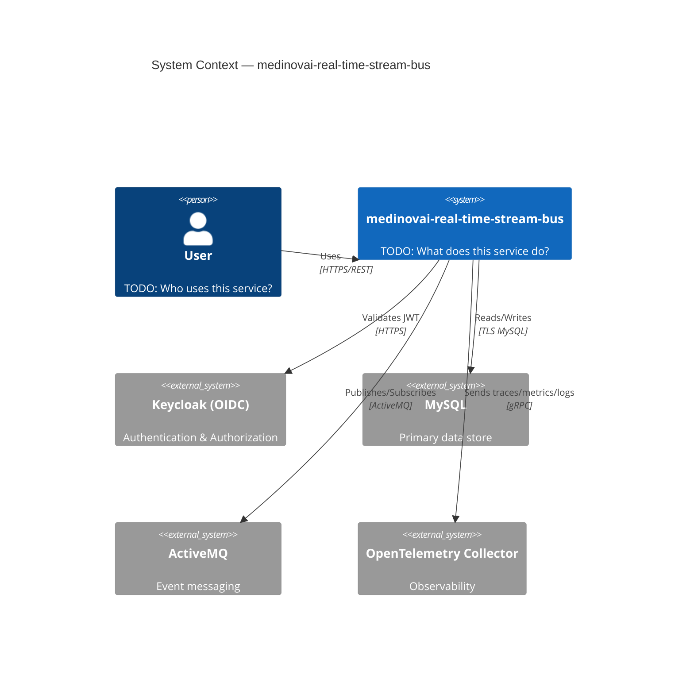
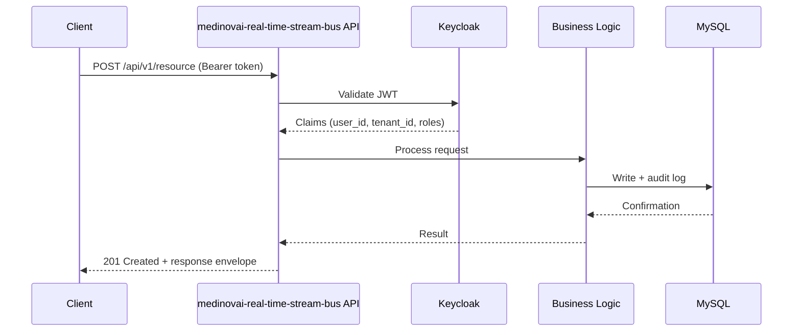

# Architecture Overview — medinovai-real-time-stream-bus

**Tier:** Tier 2 — Platform / Infrastructure (FDA Class I)
**Language:** Python
**Standard:** `medinovai-ai-standards/ARCHITECTURE.md` | C4 Model

---

## Service Purpose

> TODO: One paragraph description of what this service does and why it exists.

---

## C4 Context Diagram

---

## Key Components

| Component | Language | Purpose |
|-----------|----------|---------|
| API Layer | Python | REST endpoints, request validation, auth middleware |
| Service Layer | Python | Business logic, domain rules |
| Data Layer | Python | Database access, caching |
| Event Layer | Python | ActiveMQ publisher/subscriber |

---

## Data Flow

---

## Dependencies

| Dependency | Type | Purpose | Tier |
|------------|------|---------|------|
| medinovai-security-service | Runtime | RBAC policy decisions | Platform |
| medinovai-audit-service | Runtime | Audit trail persistence | Platform |
| MySQL | Infrastructure | Primary database | Platform |
| ActiveMQ | Infrastructure | Event messaging | Platform |
| Keycloak | Infrastructure | Identity provider | Platform |
| OpenTelemetry Collector | Infrastructure | Observability | Platform |

---

## Architecture Decision Records

| ADR | Title | Status | Date |
|-----|-------|--------|------|
| ADR-001 | TODO: First significant architectural decision | Proposed | TODO |

---

## Deployment Architecture

See `kubernetes/` or `infrastructure/` for deployment manifests.
Environment configuration via AWS Secrets Manager + environment variables.
