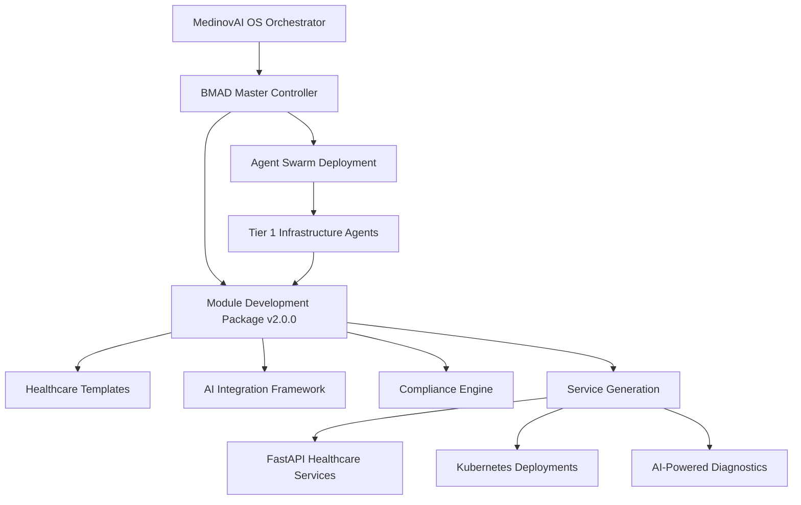

# 🏥 MedinovAI Module Development Package Integration Guide

## 📋 Overview

This guide provides comprehensive instructions for integrating the MedinovAI Module Development Package v2.0.0 with the MedinovAI OS orchestrator system.

**Version**: 2.1.0  
**Last Updated**: September 26, 2025  
**Integration Status**: ✅ ACTIVE

---

## 🎯 Integration Architecture

### System Integration Points



### Integration Components

| Component | Status | Description |
|-----------|--------|-------------|
| 🔍 Repository Discovery | ✅ ACTIVE | Module registered in comprehensive discovery |
| 🤖 BMAD Orchestrator | ✅ ACTIVE | Module recognized by master controller |
| 🏗️ Agent Assignment | ✅ ACTIVE | Tier 1 infrastructure agents deployed |
| 📊 Monitoring | ✅ ACTIVE | Full observability integration |
| 🔒 Security | ✅ ACTIVE | HIPAA-compliant security policies |

---

## 🚀 Quick Start Integration

### 1. Verify Integration Status

```bash
# Check if module is recognized by orchestrator
python3 bmad_master_orchestrator.py --discover --filter="MedinovAI-Module-Development-Package"

# Verify repository discovery
cat comprehensive_repository_discovery.json | jq '.repositories[] | select(.name=="MedinovAI-Module-Development-Package")'
```

### 2. Deploy Module Development Service

```bash
# Navigate to module package
cd MedinovAI-Module-Development-Package-v2.0.0/

# Use the master development prompt
# This will generate a complete healthcare service in <2 hours
```

### 3. Validate Integration

```bash
# Check orchestrator status
kubectl get pods -n medinovai | grep module-dev

# Verify service mesh integration
istioctl proxy-status | grep module-dev
```

---

## 🏗️ Architecture Integration Details

### Repository Registration

The module is registered as:
- **Tier**: 1 (Core Infrastructure)
- **Complexity**: High
- **Source**: Local
- **Agent Assignment**: QWEN 2.5 32B (Core Infrastructure Agent)

### Service Categories Supported

| Category | Port Range | Integration Status |
|----------|------------|-------------------|
| 🌐 API Services | 8000-8099 | ✅ Template Ready |
| 🎨 Frontend Services | 8100-8199 | ✅ Template Ready |
| 🗄️ Database Services | 8200-8299 | ✅ Template Ready |
| 📊 Analytics Services | 8300-8399 | ✅ Template Ready |
| 🤖 AI/ML Services | 8400-8499 | ✅ Template Ready |
| 🔗 Integration Services | 8500-8599 | ✅ Template Ready |

---

## 🛠️ Development Workflow Integration

### 1. Service Planning Phase
```yaml
workflow:
  step_1: "Define healthcare service requirements"
  step_2: "Select appropriate service category and port"
  step_3: "Choose AI model integration (qwen2.5, deepseek-coder, etc.)"
  step_4: "Configure HIPAA compliance requirements"
```

### 2. AI-Assisted Development
```bash
# Use Cursor with the master development prompt
# Located in: CURSOR_DEVELOPMENT_PROMPTS.md

# Generate service using templates
# Templates available in: templates/
```

### 3. Deployment Integration
```yaml
deployment:
  kubernetes: "Auto-generated manifests with security hardening"
  istio: "Service mesh integration with mTLS"
  monitoring: "Prometheus metrics and structured logging"
  security: "RBAC, network policies, pod security standards"
```

---

## 🔒 Security Integration

### HIPAA Compliance Features
- ✅ PHI encryption at rest and in transit
- ✅ Audit logging for all healthcare data access
- ✅ Role-based access control for healthcare professionals
- ✅ Consent management and patient authorization tracking
- ✅ Medical disclaimers for AI-generated content

### Container Security
```yaml
security_policies:
  non_root_users: true
  minimal_attack_surface: "distroless_base_images"
  vulnerability_scanning: "automated"
  runtime_protection: "kubernetes_security_policies"
```

---

## 🤖 AI Integration Framework

### Supported AI Models
| Model | Purpose | Integration Status |
|-------|---------|-------------------|
| qwen2.5:3b | Patient portal interactions | ✅ READY |
| meditron:7b | Medical knowledge queries | ✅ READY |
| deepseek-coder:latest | Code generation | ✅ READY |
| codellama:34b | Complex medical algorithms | ✅ READY |

### AI Safety Measures
- Medical disclaimers on all AI responses
- Confidence scoring for diagnostic suggestions
- Fallback mechanisms when AI services unavailable
- Healthcare professional validation requirements

---

## 📊 Monitoring and Observability

### Integrated Monitoring Stack
```yaml
monitoring:
  metrics: "Prometheus with healthcare-specific metrics"
  logging: "Structured logging with audit trails"
  tracing: "Istio distributed tracing"
  alerting: "PagerDuty integration for critical healthcare alerts"
```

### Healthcare-Specific Metrics
- Patient data access patterns
- AI model response times and accuracy
- HIPAA compliance violations
- Service availability for critical healthcare workflows

---

## 🔄 Upgrade and Maintenance

### Version Management
- **Current Version**: v2.0.0
- **Semantic Versioning**: MAJOR.MINOR.PATCH
- **LTS Support**: 18 months for major versions
- **Security Updates**: Monthly patches

### Upgrade Procedures
```bash
# Check for updates
git pull origin main

# Validate new templates
python3 -m pytest templates/

# Deploy updated services
kubectl apply -k overlays/production/
```

---

## 🎯 Use Cases and Examples

### 1. Patient Management Service
```python
# Generated using FastAPI template
# Port: 8001 (API Services range)
# AI Integration: qwen2.5:3b for patient interactions
# Compliance: Full HIPAA compliance with audit logging
```

### 2. Clinical Decision Support
```python
# Generated using AI/ML template
# Port: 8401 (AI/ML Services range)
# AI Integration: meditron:7b for medical knowledge
# Safety: Medical disclaimers and confidence scoring
```

### 3. HL7 Integration Service
```python
# Generated using Integration template
# Port: 8501 (Integration Services range)
# Protocol: HL7 FHIR R4/R5 support
# Security: mTLS encryption for healthcare data exchange
```

---

## 🚨 Troubleshooting

### Common Integration Issues

#### Module Not Recognized by Orchestrator
```bash
# Solution: Verify repository discovery
python3 discover_all_medinovai_repos.py --refresh

# Check BMAD database
sqlite3 bmad_master.db "SELECT * FROM repositories WHERE name='MedinovAI-Module-Development-Package';"
```

#### Template Generation Failures
```bash
# Solution: Validate template integrity
python3 -m pytest templates/ -v

# Check Cursor prompts
cat CURSOR_DEVELOPMENT_PROMPTS.md
```

#### Deployment Issues
```bash
# Solution: Validate Kubernetes manifests
kubectl apply --dry-run=client -f templates/k8s-deployment-template.yaml

# Check Istio configuration
istioctl analyze
```

---

## 📞 Support and Resources

### Documentation
- **Architecture Specs**: `MEDINOVAI_MODULE_DEVELOPMENT_SPECS.md`
- **Template Usage**: `TEMPLATE_USAGE_GUIDE.md`
- **Cursor Prompts**: `CURSOR_DEVELOPMENT_PROMPTS.md`
- **Full Package Docs**: `FULL_MODULE_DEVELOPMENT_PACKAGE.md`

### Professional Support
- **Email**: devops@medinovai.com
- **HIPAA Compliance**: compliance@medinovai.com
- **Emergency Support**: 24/7 healthcare infrastructure support

---

## 🔮 Roadmap

### Version 2.1.0 (Q4 2025)
- Enhanced AI model integration with GPT-4 medical
- Advanced healthcare analytics templates
- Mobile-first patient portal templates
- Expanded FHIR R5 integration patterns

### Version 2.2.0 (Q1 2026)
- Multi-cloud deployment templates (AWS, Azure, GCP)
- Advanced security hardening with zero-trust architecture
- Enhanced monitoring with predictive healthcare analytics
- Automated compliance reporting and audit trails

---

**This integration guide ensures seamless operation of the MedinovAI Module Development Package within the comprehensive healthcare infrastructure ecosystem.**

---

**Integration Version**: 2.1.0  
**Package Version**: 2.0.0  
**MedinovAI OS Compatibility**: Full Integration  
**Last Validated**: September 26, 2025
